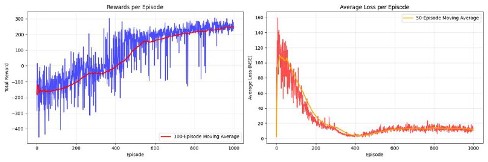

# 🚀 Deep Q-Network (DQN) for LunarLander-v3

This project implements a **Deep Q-Network (DQN)** to solve the **LunarLander-v3** environment from OpenAI Gym.  
The agent learns to land the lunar module safely using reinforcement learning.

---


## 🎥 The enhancement of the agent progress

👉 [Watch Demo](media/video.gif)

---


## 📌 Concept

The **main idea** behind DQN is to combine:
1. **Q-Learning** → estimating the value of actions given states.  
2. **Deep Neural Networks** → to approximate the Q-function.  
3. **Experience Replay** → storing past experiences in a buffer to sample from them randomly, which breaks correlation and improves learning.  
4. **Target Network** → a fixed copy of the Q-network that is updated slowly (soft update) for more stable training.

---

## 🏗️ Network Architecture

The **DQN** uses a simple **feedforward neural network** with 2 hidden layers:

- **Input Layer** → takes the state (8 values in LunarLander).  
- **Hidden Layer 1** → 64 neurons, ReLU activation.  
- **Hidden Layer 2** → 64 neurons, ReLU activation.  
- **Output Layer** → number of possible actions (4 in LunarLander).  

```python
class DQNNetwork(nn.Module):
    def __init__(self, state_size, action_size, seed=42):
        super(DQNNetwork, self).__init__()
        self.seed = torch.manual_seed(seed)
        self.fc1 = nn.Linear(state_size, 64)
        self.fc2 = nn.Linear(64, 64)
        self.fc3 = nn.Linear(64, action_size)
        
    def forward(self, x):
        x = F.relu(self.fc1(x))
        x = F.relu(self.fc2(x))
        return self.fc3(x)
```

---

## ⚙️ Hyperparameters

| Hyperparameter        | Value        | Description |
|-----------------------|-------------|-------------|
| Replay Buffer Size    | `100,000`   | Maximum number of past experiences stored |
| Batch Size            | `100`       | Number of samples per training step |
| Discount Factor (γ)   | `0.99`      | How much future rewards are valued |
| Learning Rate (α)     | `5e-4`      | Step size for optimizer |
| Update Frequency      | `4` steps   | How often the network is updated |
| Soft Update (τ)       | `1e-3`      | Rate of slowly updating target network |

---

## 🔑 Important Functions

### 1. Soft Update (stabilizing training)
The **soft update** ensures that the target network is updated slowly towards the local network, which avoids large fluctuations.

```python
def soft_update(local_model, target_model, tau):
    for target_param, local_param in zip(target_model.parameters(), local_model.parameters()):
        target_param.data.copy_(tau*local_param.data + (1.0-tau)*target_param.data)
```

➡️ **Explanation**:  
- `tau` is a small number (e.g., `1e-3`).  
- Instead of replacing the weights completely, we blend them:  
  `θ_target ← τ*θ_local + (1-τ)*θ_target`  

---

### 2. Learning Step (update rule)
The **learning step** samples from the replay buffer and updates the Q-values.

```python
def learn(experiences, gamma):
    states, actions, rewards, next_states, dones = experiences

    Q_targets_next = target_model(next_states).detach().max(1)[0].unsqueeze(1)
    Q_targets = rewards + (gamma * Q_targets_next * (1 - dones))

    Q_expected = local_model(states).gather(1, actions)

    loss = F.mse_loss(Q_expected, Q_targets)
    optimizer.zero_grad()
    loss.backward()
    optimizer.step()
```

➡️ **Explanation**:  
- `Q_expected` = predicted Q-values.  
- `Q_targets` = actual Q-values using target network.  
- Minimize **MSE loss** between them.

---

## 📊 Training Results

- **Learning Curve**: Below is the **loss and reward per episode**.  
- The agent learns to land successfully after 400 episode.



---


## 📌 How to Run

```bash
pip install -r requirements.txt
python main.py
```

---

## ✅ Summary

- DQN learns by combining **neural networks, replay buffer, and target network**.  
- **Soft update** stabilizes training.  
- The agent improves gradually as shown in the reward curve and demo video.

---
